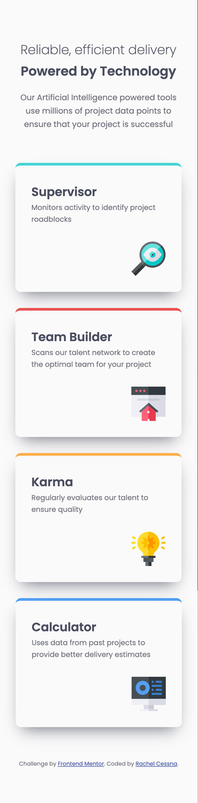
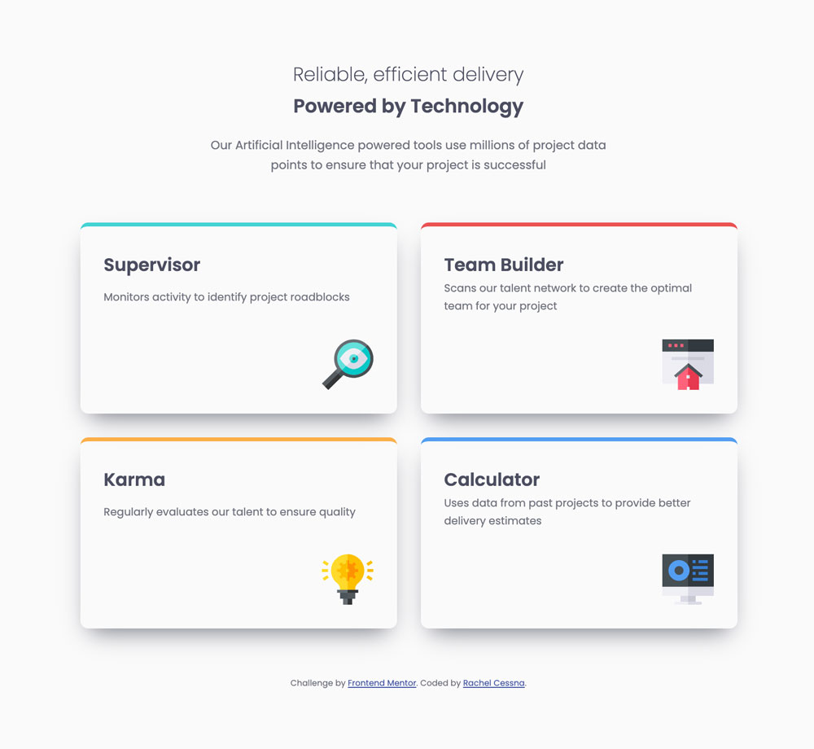
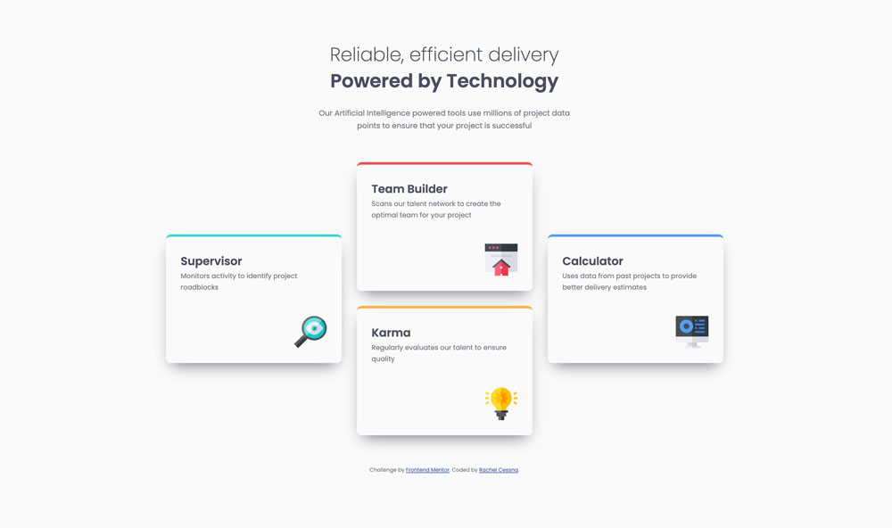

# Frontend Mentor - Four card feature section solution

This is a solution to the [Four card feature section challenge on Frontend Mentor](https://www.frontendmentor.io/challenges/four-card-feature-section-weK1eFYK). Frontend Mentor challenges help you improve your coding skills by building realistic projects. 

## Table of contents

- [Overview](#overview)
  - [The challenge](#the-challenge)
  - [Screenshots](#screenshots)
  - [Links](#links)
- [My process](#my-process)
  - [Built with](#built-with)
  - [What I learned](#what-i-learned)
  - [Accessibility Note](#accessibility-note)
  - [Continued development](#continued-development)
  - [Useful resources](#useful-resources)
- [Author](#author)

## Overview

### The challenge

Users should be able to:

- View the optimal layout for the site depending on their device's screen size

### Screenshots

#### Mobile Layout



#### Tablet Layout



#### Desktop Layout



### Links

- Solution URL: [GitHub Repo](https://github.com/cessnar516/FM-4-card-feature)
- Live Site URL: [GitHub Pages](https://cessnar516.github.io/FM-4-card-feature/)

## My process

### Built with

- Semantic HTML5 markup
- SASS
- CSS Grid
- Flexbox
- Mobile-first workflow

### What I learned

I used a combination of CSS Grid and Flexbox to create the layouts for this challenge. CSS Grid was used for the placement of the cards in the layout and Flexbox was used to arrange the content inside of the cards - specifically the icons. Flexbox made positioning the icons in the bottom right corner of the card possible with just a few lines of CSS:

```css
.card {
  display: flex;
  flex-direction: column;
  justify-content: space-between;
}
.card img {
  align-self: flex-end;
}
```

The style guide for this challenge only called for a mobile and desktop layout, but I decided to add in a tablet layout as well to make the content more visually pleasing at medium screen sizes. The cards stack vertically in one column on mobile screens, but as the screen gets larger, the cards display in two columns. This layout was created using the following CSS:

```css
.cards {
  display: grid;
  grid-template-columns: repeat(auto-fit, minmax(auto, 400px));
  grid-gap: 2em;
  justify-content: center;
}
```

Using the repeat and minmax functions together to create the grid columns constrains the width of each card to 400 pixels and allows the cards to display in two columns when there is enough space. 

On desktop-sized screens, the layout is completely changed by redefining the grid and specifying specific row and column placement for each of the cards; however, the structure of the HTML remains exactly the same. Here's the new grid css:

```css
@media screen and (min-width: 1440px) {
  .cards {
    grid-template-columns: repeat(3, minmax(auto, 350px));
    grid-template-rows: repeat(4, 1fr);
  }
}
```

Each column will never be wider than 350 pixels, and the grid now has four equally sized rows explicitly defined. Each card is then positioned on the grid using column and row line numbers. For example, the Karma card is located in the second column and spans the third and fourth rows, so the CSS for that card looks like this:

```css
@media screen and (min-width: 1440px) {
  #karma {
    grid-column: 2/3;
    grid-row: 3/5;
  }
}
```

### Accessibility Note

The color originally specified in the style guide for the body text did not meet the minimum contrast requirement for WCAG AA compliance, so I adjusted it. Meeting the minimum contrast requirement is important because it allows individuals with low vision and/or color blindness to clearly see the information. 

Original color from style guide: hsl(299, 6%, 66%)

WCAG AA compliant color: hsl(231, 6%, 47%)

### Continued development

CSS Grid is still relatively new for me, so I plan to continue to explore combining it with Flexbox to create more advanced layouts. 

It took me a while to get the box shadow on the cards to look the way I wanted it to, so I need more practice with those. 

### Useful resources

- [Box Shadow CSS Generator](https://cssgenerator.org/box-shadow-css-generator.html) - This site helped me get a better understanding of how to code box shadows. I really like that you can adjust the sliders for each property and see the effects on the sample box.
- [WebAIM Contrast Checker](https://webaim.org/resources/contrastchecker/) - This is a great tool for checking you color combinations to make sure they meet WCAG specifications.

## Author

- LinkedIn - [Rachel Cessna](https://www.linkedin.com/in/rachelacessna/)
- Frontend Mentor - [@cessnar516](https://www.frontendmentor.io/profile/cessnar516)
- CodePen - [@cessnar](https://codepen.io/cessnar)